# 说点什么

复现**某网站字幕加密的wasm分析**过程，并使用python完成对wasm的调用以获取字幕解密key

- 目标地址 https://www.iq.com/play/2faqbd15uac
- 有关分析文章 https://www.52pojie.cn/thread-1461335-1-1.html

之前其实有写一篇wasm调用的文章，但是没有公开

既然现在有一篇现成的，那不如就拿它做个演示~

# 环境和工具

- chrome-standalone-v91.zip 最新免安装版Chrome

**注意，文章中的代码均为完整代码的片段**

# 过程

首先打开网址，观察一下它的请求


可以看到wasm和字幕是挨着加载的

这个时候，推荐使用[polyv加密key解密过程定位教程](https://blog.weimo.info/archives/599/)里提到的方法来定位加密字幕的解密位置

**关键点追踪**和**异常定位法**搭配使用

首先点开字幕请求的`Initiator`，点开第一个位置，在这里后一行下断点，刷新网页

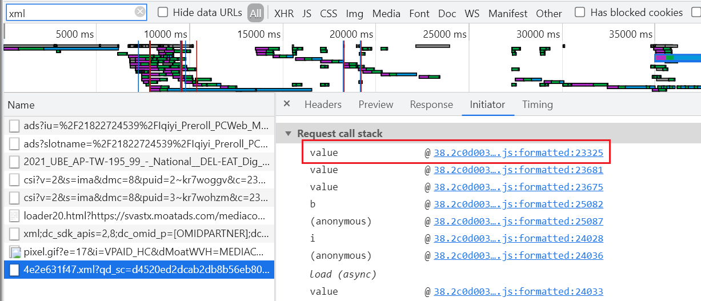

然后会停在这里，点下一步

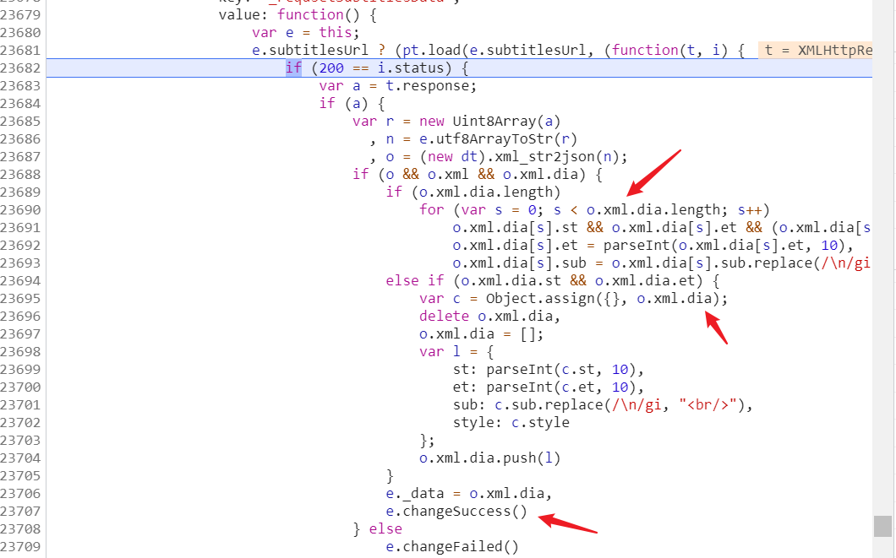

可以看到这里的一些东西就是字幕请求结果的东西

然后在`e.changeSuccess()`下断点，跳到这里

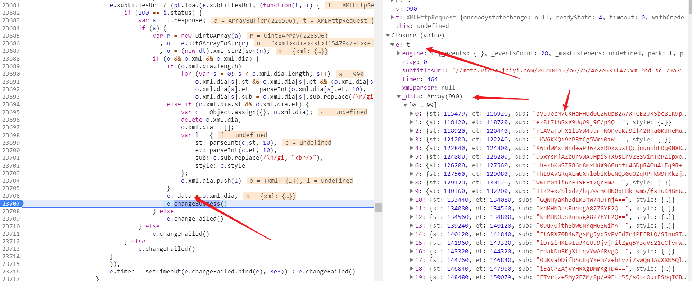

显然这里就是加密字幕内容了

现在是时候展现**异常定位法**的效果了，通过下面的代码将加密的内容设置为连续0的字符串

```javascript
e._data.forEach((item) => {console.log(item.sub = "00000000000000000000000000000000000000000000000000000000000000000000000000")});
```

去掉断点，让代码接着运行


很好！现在有报错提示了，如果没有可能是当前播放的时间点没有字幕要显示，自行拉一下进度条

直接点过去看看

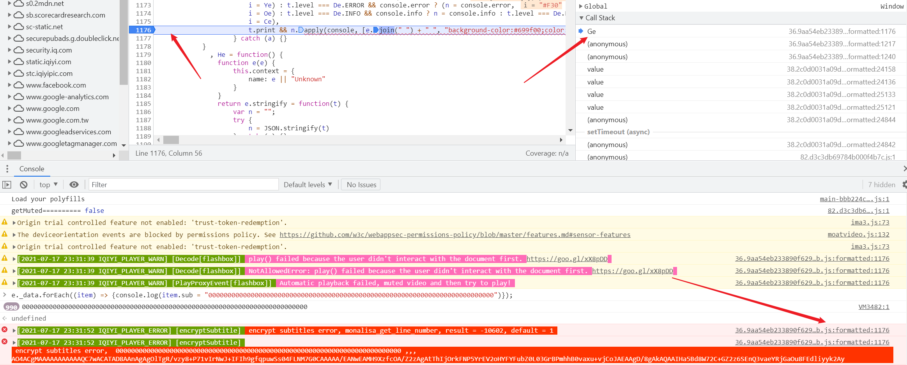

在这个位置下断点，很快会停在这里，这个时候看不出来解密位置，不慌跟着调用栈看看

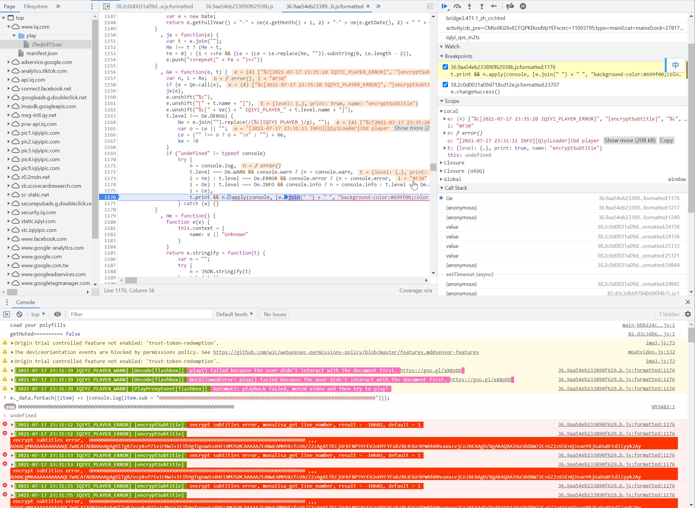

哗的一下，很快啊，就定位到关键位置了

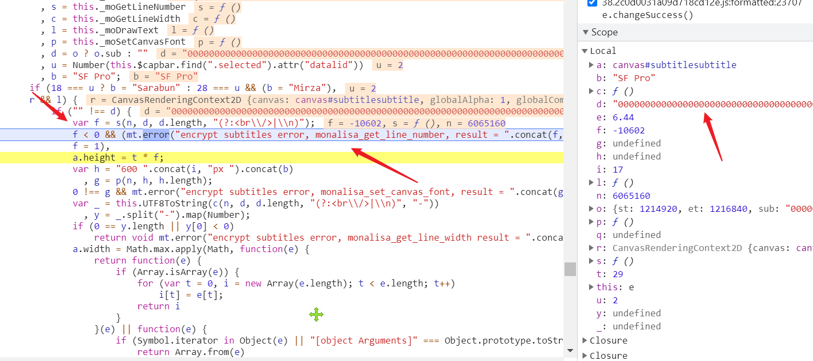

`d`是修改后的“加密字幕内容”内容，经过函数`s`后就出现了看到的异常提示，显然它是在解密

在函数`s`这里下断点，继续运行代码，停在断点这里之后，单步跟进去

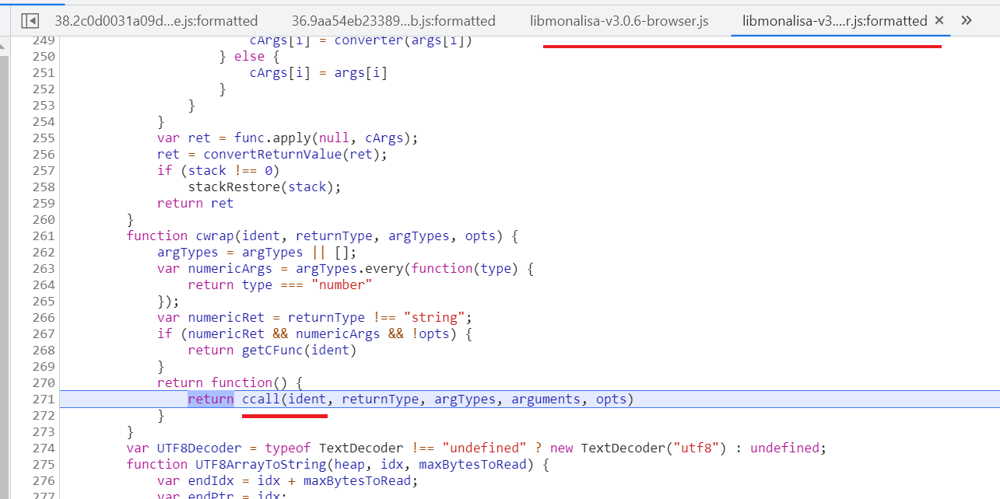

是`ccall`，那是wasm解密没跑了，这个关键词是浏览器使用wasm的一个标志性关键词


浏览器上JavaScript和WebAssembly具体怎么交互，这里就不详细展开了，请自行查阅MDN的文档

- [调用一个定义在C中的自定义方法](https://developer.mozilla.org/zh-CN/docs/WebAssembly/C_to_wasm#%E8%B0%83%E7%94%A8%E4%B8%80%E4%B8%AA%E5%AE%9A%E4%B9%89%E5%9C%A8c%E4%B8%AD%E7%9A%84%E8%87%AA%E5%AE%9A%E4%B9%89%E6%96%B9%E6%B3%95)
- [Calling compiled C functions from JavaScript using ccall/cwrap](https://emscripten.org/docs/porting/connecting_cpp_and_javascript/Interacting-with-code.html#calling-compiled-c-functions-from-javascript-using-ccall-cwrap)

这里主要说下js调用wasm的几个关键流程

- 首先开辟一块内存
    ```javascript
    wasmMemory = new WebAssembly.Memory({
        "initial": INITIAL_INITIAL_MEMORY / WASM_PAGE_SIZE,
        "maximum": 2147483648 / WASM_PAGE_SIZE
    })
    ```
- 初始化缓冲区和视图
    ```JavaScript
    function updateGlobalBufferAndViews(buf) {
        buffer = buf;
        Module["HEAP8"] = HEAP8 = new Int8Array(buf);
        Module["HEAP16"] = HEAP16 = new Int16Array(buf);
        Module["HEAP32"] = HEAP32 = new Int32Array(buf);
        Module["HEAPU8"] = HEAPU8 = new Uint8Array(buf);
        Module["HEAPU16"] = HEAPU16 = new Uint16Array(buf);
        Module["HEAPU32"] = HEAPU32 = new Uint32Array(buf);
        Module["HEAPF32"] = HEAPF32 = new Float32Array(buf);
        Module["HEAPF64"] = HEAPF64 = new Float64Array(buf)
    }
    updateGlobalBufferAndViews(buffer);
    ```
- 将动态基址写入特定位置
    ```JavaScript
    HEAP32[DYNAMICTOP_PTR >> 2] = DYNAMIC_BASE;
    ```
- 定义一些外部函数，即wasm内调用js这边的函数，用处很多，比如交换数据，检查环境等等
- 将外部函数、内存等作为一个对象传递给**WebAssembly.instantiate**，完成初始化
    ```javascript
    var asmLibraryArg = {
        "a": ___sys_fcntl64,
        "d": ___sys_ioctl,
        "e": ___sys_open,
        "f": ___sys_rmdir,
        "g": ___sys_unlink,
        "h": _clock,
        "l": _emscripten_memcpy_big,
        "m": _emscripten_resize_heap,
        "j": _emscripten_run_script,
        "r": _emscripten_run_script_int,
        "q": _emscripten_run_script_string,
        "n": _environ_get,
        "o": _environ_sizes_get,
        "c": _fd_close,
        "p": _fd_read,
        "k": _fd_seek,
        "b": _fd_write,
        "memory": wasmMemory,
        "table": wasmTable,
        "i": _time
    };
    var info = {
        "a": asmLibraryArg
    };
    ```
- 将wasm的导出函数和一些有意义函数名进行绑定，这一步可有可无
    ```javascript
    var ___wasm_call_ctors = Module["___wasm_call_ctors"] = function() {
        return (___wasm_call_ctors = Module["___wasm_call_ctors"] = Module["asm"]["s"]).apply(null, arguments)
    };
    var _monalisa_set_canvas_id = Module["_monalisa_set_canvas_id"] = function() {
        return (_monalisa_set_canvas_id = Module["_monalisa_set_canvas_id"] = Module["asm"]["t"]).apply(null, arguments)
    };
    ```
- 然后就是调用交互了
    ```javascript
    function ccall(ident, returnType, argTypes, args, opts) {
        var toC = {
            "string": function(str) {
                var ret = 0;
                if (str !== null && str !== undefined && str !== 0) {
                    var len = (str.length << 2) + 1;
                    ret = stackAlloc(len);
                    stringToUTF8(str, ret, len)
                }
                return ret
            },
            "array": function(arr) {
                var ret = stackAlloc(arr.length);
                writeArrayToMemory(arr, ret);
                return ret
            }
        };
        function convertReturnValue(ret) {
            if (returnType === "string")
                return UTF8ToString(ret);
            if (returnType === "boolean")
                return Boolean(ret);
            return ret
        }
        var func = getCFunc(ident);
        var cArgs = [];
        var stack = 0;
        if (args) {
            for (var i = 0; i < args.length; i++) {
                var converter = toC[argTypes[i]];
                if (converter) {
                    if (stack === 0)
                        stack = stackSave();
                    cArgs[i] = converter(args[i])
                } else {
                    cArgs[i] = args[i]
                }
            }
        }
        var ret = func.apply(null, cArgs);
        ret = convertReturnValue(ret);
        if (stack !== 0)
            stackRestore(stack);
        return ret
    }
    ```

有了上述知识后，那么想用python调用，只要完成上面的部分过程即可

也就是下面这些问题

- 内存给多大，怎么给？
- python怎么定义导入函数？
- 初始化参数准备好了怎么初始化？
- 初始化完成了怎么调用导出函数？
- 调用了函数怎么拿到返回结果？

好在已经有比较完善的python库可以完成上述过程，它就是[wasmer-python](https://github.com/wasmerio/wasmer-python)

详细的案例可以参考

- https://github.com/wasmerio/wasmer-python/tree/master/examples


首先初始化一个存储器

```python
store = Store(engine.JIT(Compiler))
```

接着载入wasm，因为需要修改wasm内容，所以这里读取的是wat，后面会讲

```python
wasm = Path(r'iq_wasm/files/libmonalisa-v3.0.6-browser.wasm').read_bytes()
module = Module(store, wasm)
```

然后初始化内存

```python
memory = Memory(store, MemoryType(256, 256, shared=False))
```

最后是生成导入对象，初始化实例

```python
import_object = ImportObject()
import_object.register('a', _import_object)
asm = Instance(module, import_object=import_object)
```

现在测试一下正不正常

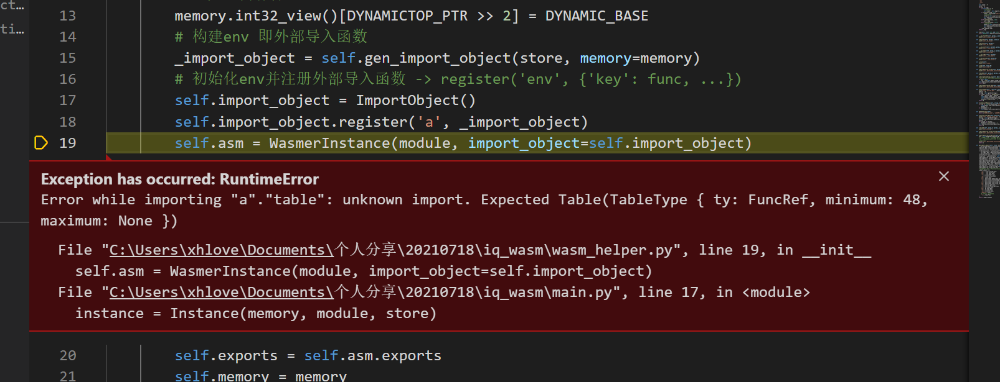

然而报错了，这是为什么呢，根据我的经验，似乎这是因为`wasmer-python`仍然有一些地方不完善

如果导入的对象中，有table，那就会这个报错，虽然提供了Table类型的函数，但是有一个变量一直有问题

基于这个原因，需要修改wasm，当然不是直接改wasm，而是修改对应的wat文件

用wabt进行转换

```bash
..\\..\\wabt\\bin\\wasm2wat.exe libmonalisa-v3.0.6-browser.wasm -o libmonalisa-v3.0.6-browser.wat
```

然后把`table`这一行改一下

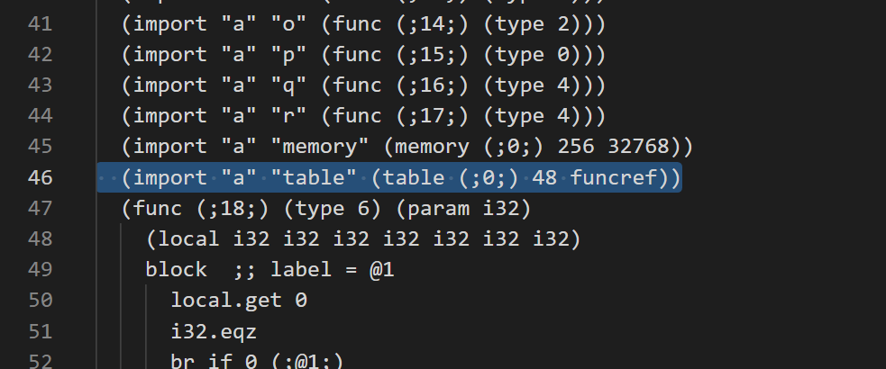

> (table $a.table (;0;) 48 48 funcref)

这样就不用导入这个了

对应的，现在用另外一种方式读取载入wasm

```python
wasm = wat2wasm(Path(r'iq_wasm/files/libmonalisa-v3.0.6-browser.wat').read_text(encoding='utf-8'))
```

现在有两个关键点

- 导入对象中的具体函数怎么写
- 怎么调用导出函数才能和浏览器结果一样

先说导入对象的函数，以`_environ_get`为例

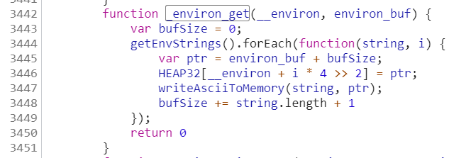

这是python中的写法，简单来说wasm和js交互的时候就是在改变其内存区域的数据，按对应的逻辑操作内存数据就行了

```python
def _environ_get(self, __environ, environ_buf):
    print('call _environ_get', __environ, environ_buf)
    bufSize = 0
    strings = self.getEnvStrings()
    for index, string in enumerate(strings):
        ptr = environ_buf + bufSize
        self.memory.int32_view()[__environ + index * 4 >> 2] = ptr
        self.writeAsciiToMemory(string, ptr)
        bufSize += len(string) + 1
    return 0

def writeAsciiToMemory(self, string, buffer, dontAddNull: int = 0):
    for num in list(string.encode('utf-8')):
        self.memory.int8_view()[buffer >> 0] = num
        buffer += 1
    if dontAddNull == 0:
        self.memory.int8_view()[buffer >> 0] = 0
```

然后按下面这样用`Function`包裹函数，然后构建一个字典

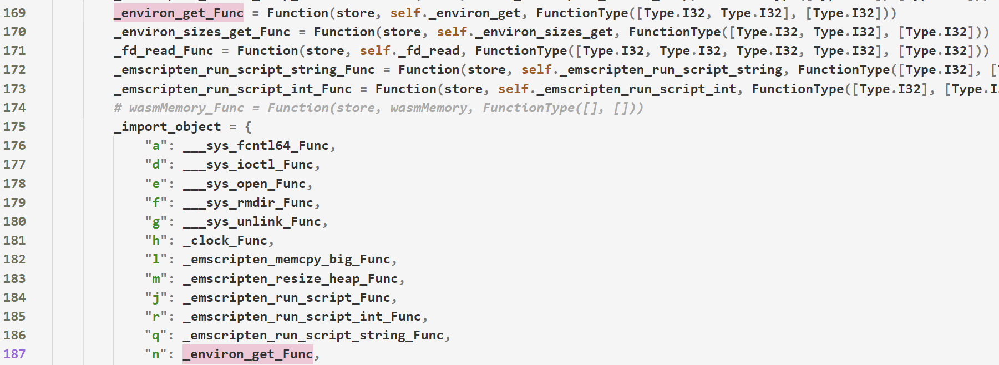

实例化`ImportObject`后通过`register`完成导入对象的设置，最后进行wasm实例化

```python
self.import_object = ImportObject()
self.import_object.register('a', _import_object)
self.asm = WasmerInstance(module, import_object=self.import_object)
```

`Function`后面的`FunctionType`怎么来的呢

这个可以通过查看wat代码对应，准备好wasm相关的工具[wabt](https://github.com/WebAssembly/wabt)

先用`wasm2wat`将wasm转换为wat文件

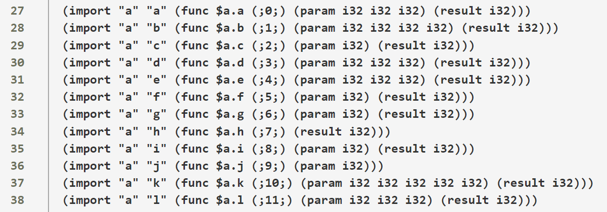

这里可以看到导入函数的参数与结果类型，按这个去写就可以了

另外导入函数只要定义了就行，不一定需要具体返回什么

为了达到调用目的，还需要写一个python的ccall

先看看js这里怎么写的，翻译一份，`ccall`部分如下

```python
def ccall(self, func_name: str, returnType: 'type', *args):
    def convertReturnValue(_ptr: int):
        if returnType == str:
            return self.UTF8ToString(_ptr)
        elif returnType == bool:
            return bool(returnType)
        return _ptr
    stack = 0
    _args = []
    for arg in args:
        if isinstance(arg, str):
            if stack == 0:
                stack = self.stackSave()
            max_write_length = (len(arg) << 2) + 1
            ptr = self.stackAlloc(max_write_length)
            self.stringToUTF8(arg, ptr, max_write_length)
            _args.append(ptr)
        elif isinstance(arg, list):
            ptr = self.stackAlloc(len(arg))
            ptr = self.writeArrayToMemory(arg, ptr)
            _args.append(ptr)
        else:
            _args.append(arg)
    ptr = self.export_configs[func_name](*_args)
    ret = convertReturnValue(ptr)
    if stack != 0:
        self.stackRestore(stack)
    return ret
```

其他子函数参见完整代码

现在就可以传递参数了，但在此之前需要知道浏览器初始化wasm的时候都做了哪些动作

所以先在所有的导出函数下断点，刷新调试，下图是一部分


导入部分的函数调用不下断点是因为可以通过python调用的时候看出来

刷新网页，等停在断点

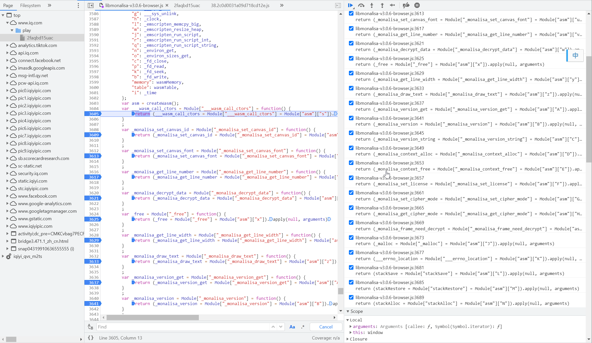

可以看到依次调用了

- `___wasm_call_ctors`
- `_monalisa_context_alloc`
- `stackSave`

到`stackSave`的时候是从`ccall`来的，那么这之前应该先调用上面两个函数

`___wasm_call_ctors`是直接调用的，且没有参数

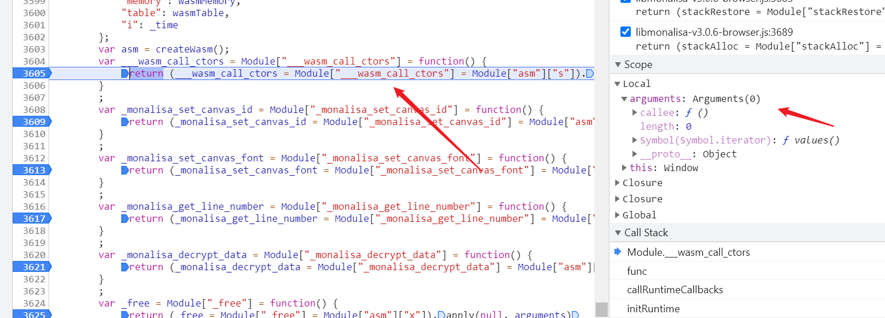

`_monalisa_context_alloc`同上

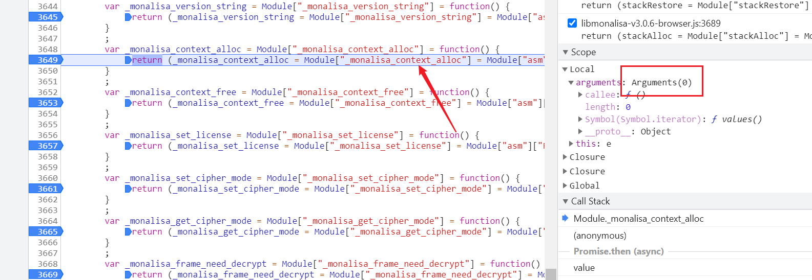

那么初始化函数就这样写

```python
def doinit(self):
    self.___wasm_call_ctors()
    self._monalisa_context_alloc()
```

然后是`stackSave`，这个时候根据调用栈，可以知道这里是在设置license

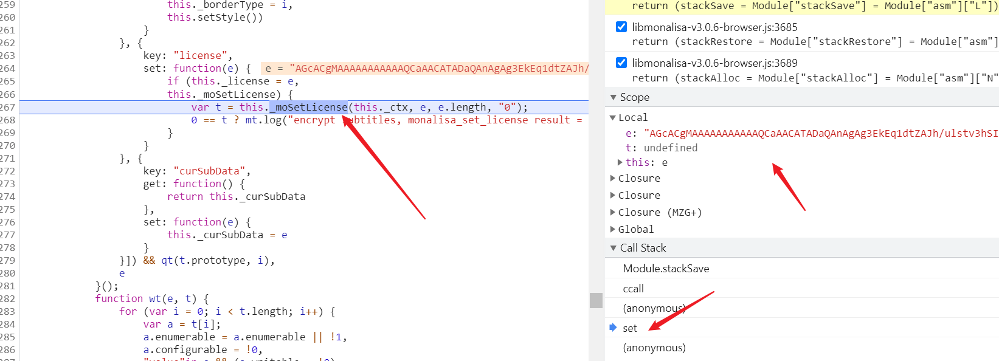

切换下调用栈，参数有4个


按下面的代码调用

```python
def _moSetLicense(self):
    license = 'AIUACgMAAAAAAAAAAAQChgACATADhwAnAgAg3UBbUdVCWXAjkgoUgmICmHvomvZai0jGglWe+oaQC+MCAAAAA4gANwEAMHStDt3ZksUi3Q7ZpevUL0ce2NA73SNiqOJW3Wc0P6B62xYg8yiWFF92KXEGjljOeQEAAgD/iQAkAQAAIKgivL0LDGFSYlwcToEO6LCRYFZjE3lycoiZDPxiNXFo'
    ret = self.ccall('monalisa_set_license', int, self._ctx, license, len(license), '0')
    print('_moSetLicense', ret)
```

下一个是`_monalisa_set_canvas_id`，这里参数也比较明了

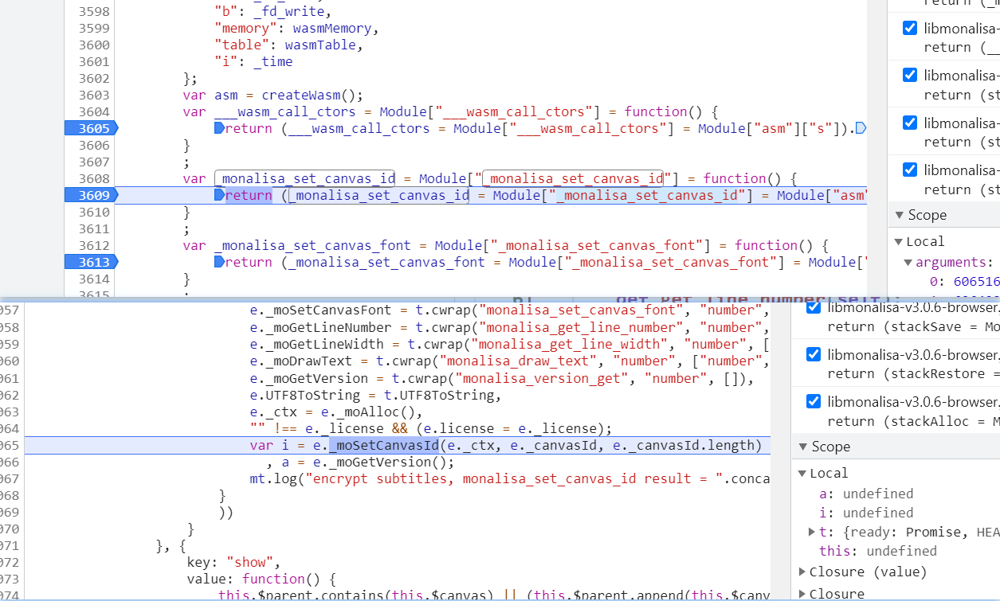

```python
def _moSetCanvasId(self):
    _canvasId = 'subtitlesubtitle'
    ret = self.ccall('_monalisa_set_canvas_id', int, self._ctx, _canvasId, len(_canvasId))
    print('_moSetCanvasId', ret)
```

同理，接着是`_monalisa_version_get`

```python
def _moGetVersion(self):
    ret = self.export_configs['_monalisa_version_get']()
    print('_moGetVersion', ret)
```

然后是`monalisa_get_line_number`

```python
def get_line_number(self):
    enc_text = 'F6vjGQAlaXWf/rYLFkGHQLok+aI/X+7MBJI6EmzYtZ4='
    ret = self.ccall('monalisa_get_line_number', int, self._ctx, enc_text, len(enc_text), '(?:<br\\/>|\\n)')
    print('get_line_number', ret)
```

然后跑python代码出了异常


这是因为在`_emscripten_run_script_int`这里没有给返回结果

分析js确定这里实际上返回的是解密后字幕的行数，一般都是1，直接返回1就行

```python
def _emscripten_run_script_int(self, param_0):
    text = self.UTF8ToString(param_0)
    # 原函数这里是运行一段js代码 这里是python 所以运行不了
    # 按执行对应的结果给返回即可 必须这里是根据<br>返回字幕行数的
    # eval(text)
    print('call _emscripten_run_script_int', text)
    return 1
```

然后是调用`_monalisa_set_canvas_font`，这个时候后面就没有必要继续模拟了

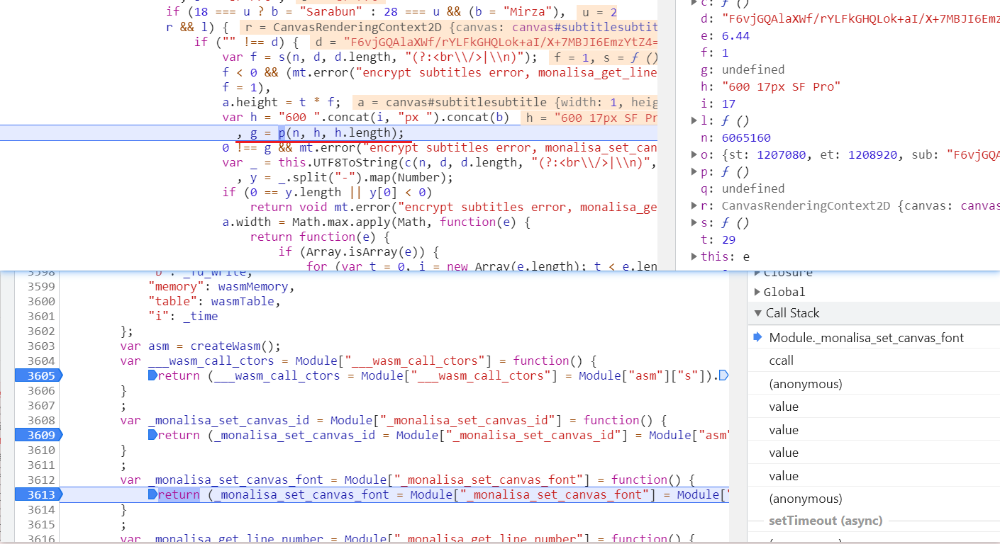

因为这个时候明文已经有了，所以达成了调用目的了

上面调用过程说的差不多了，那解密key在哪儿呢

首先参考渔哥的帖子，先把wasm编译为`.o`文件

这里用`逍遥一仙`的工具


然后拖入IDA

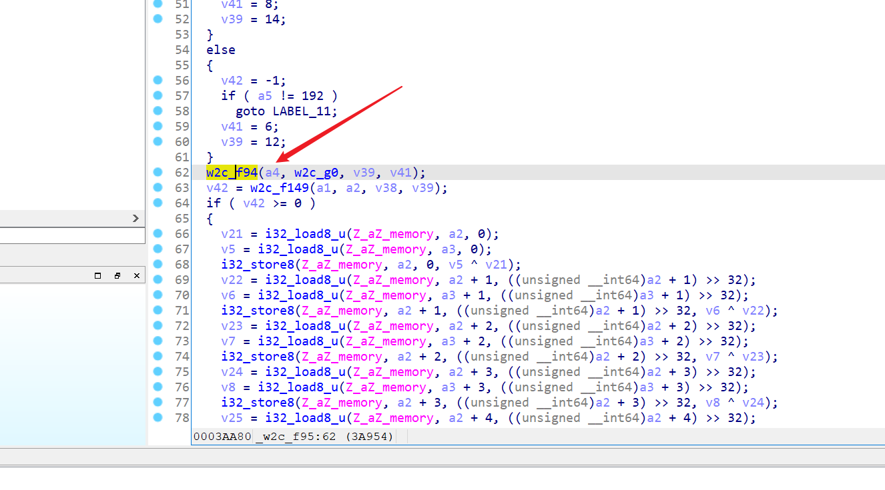

根据已知信息，可以知道`w2c_f94`的参数一就是解密的密钥

那到浏览器对应位置下断点看看，开始几轮没有，然后就有了

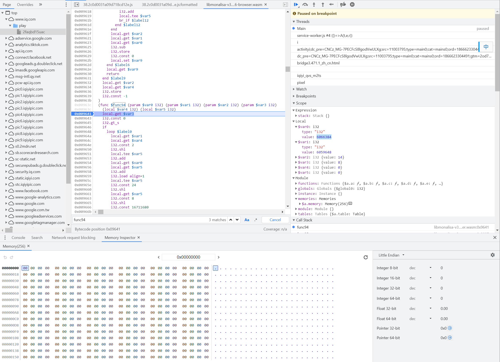

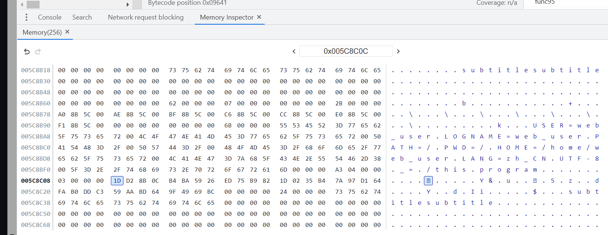

那解密key就是

- `1dd28b0cb4ba5926ed75b9821d0235b4`


在`monalisa_set_license`后保存一下全部内存，搜索一下

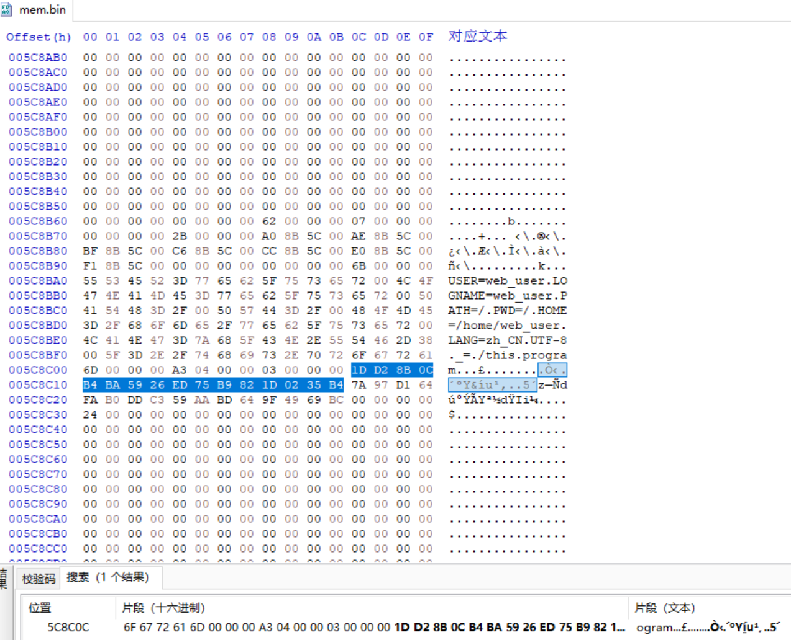

可以看到key在内存中

由于wasm的运算机制，输入不变，那中间产生的变量啊什么的，都会在固定位置

那完全可以在调用完`monalisa_set_license`之后读取这个位置的内容就能拿到key了

至此调用wasm获取解密key完成


# 其他

开始的的aes解密

```python
from Crypto.Util import Padding

key = binascii.a2b_hex('2bdf7c2c2a13485a1b0ba6783a8988379dd3566d3cd98da8d61c89f4bffd55ea')
data = binascii.a2b_hex('1941020764a14c82d788e8bff84facb2f3621f4cd6a789e7494941376a1a825da32aeba81e1979e31022c883552f3bd8')
cipher = AES.new(key, AES.MODE_CBC, iv=bytes([0] * 16))
cc = cipher.decrypt(data)
cc = Padding.unpad(cc, 16)
cc.hex()
48498f4526525579bdfd1872092b4ba0da457338e5ca94e5fa7e1168f81b3c6468092a2c0c0c0c0c0c0c0c0c0c0c0c0c
48498f4526525579bdfd1872092b4ba0da457338e5ca94e5fa7e1168f81b3c6468092a2c
```