目标apk与md5

- com.cmcc.cmvideo_5.9.3.10_25000599.apk
- 81d38496ac24e05e3b9f1fc79cfb4d6d

# 分析记录

## 初步静态分析

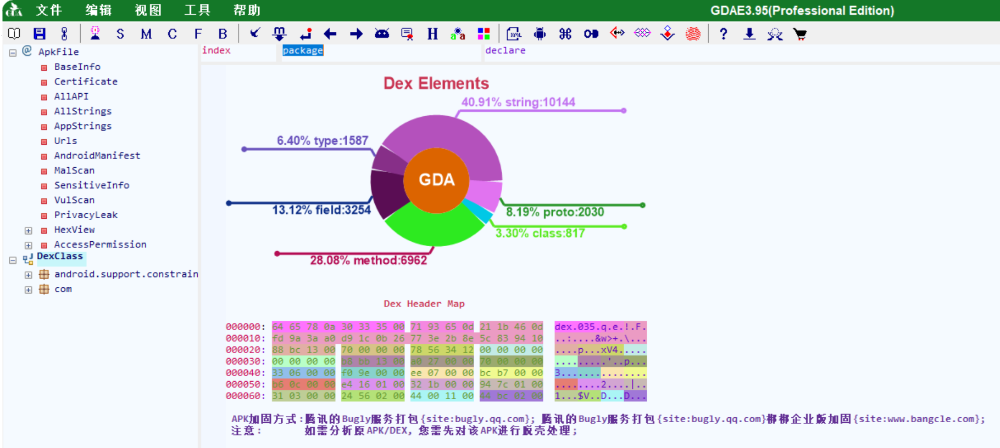

不好，有壳，那么先脱壳一波再说

- https://github.com/hluwa/FRIDA-DEXDump

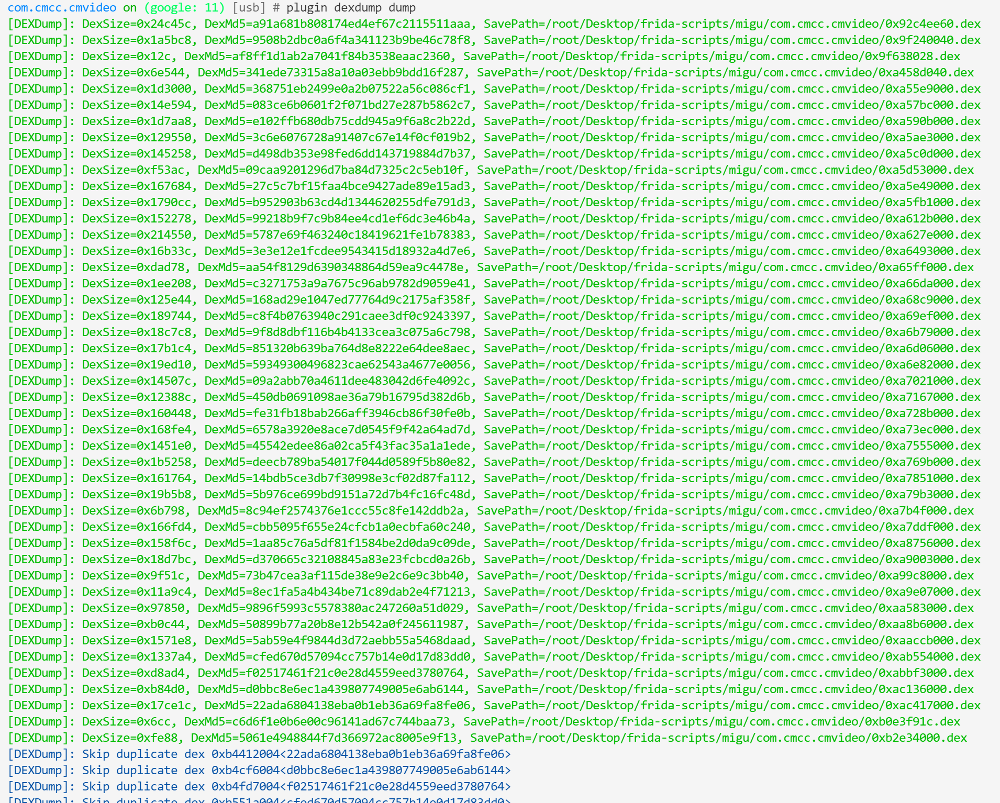

脱出来的dex可能有不能直接用jadx-gui直接打开的，不打开它便是

最终留下这些

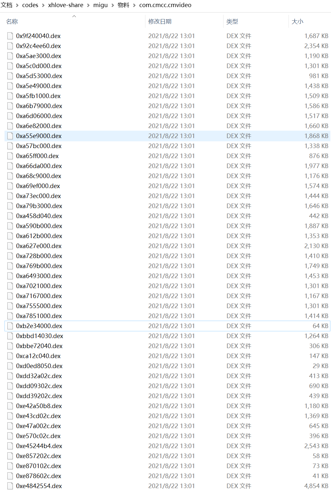

## 抓包视频接口

开启抓包软件，打开一个视频进行抓包


显然比较重要的参数应该是这几个

- sign
- l_c
- l_s

初步搜索，推测是这个类

- `com.cmvideo.capability.mgplayercore.net.VideoDetailsRequestHelper`

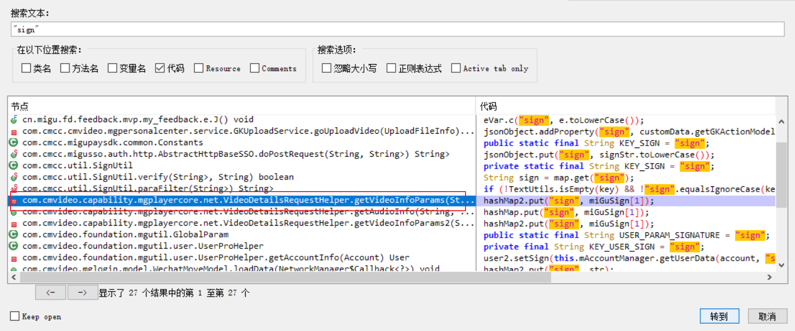

用objection辅助分析

```bash
objection -g com.cmcc.cmvideo explore -P ~/.objection/plugins/
android hooking watch class com.cmvideo.capability.mgplayercore.net.VideoDetailsRequestHelper
```

进一步查看

```bash
android hooking watch class_method com.cmvideo.capability.mgplayercore.net.VideoDetailsRequestHelper.updateVideoInfo --dump-args --dump-backtrace --dump-return
```

得到如下结果

```java
(agent) [693091] Called com.cmvideo.capability.mgplayercore.net.VideoDetailsRequestHelper.updateVideoInfo(com.cmvideo.foundation.bean.player.VideoBean, com.cmvideo.foundation.bean.player.VideoInfoBean)
(agent) [693091] Backtrace:
        com.cmvideo.capability.mgplayercore.net.VideoDetailsRequestHelper.updateVideoInfo(Native Method)
        com.cmcc.cmvideo.player.PlayHelper$2.onVideoInfoCallback(PlayHelper.java:282)
        com.cmvideo.foundation.videocache.chain.VideoInfoInvocationChain$3$1.run(VideoInfoInvocationChain.java:213)
        android.os.Handler.handleCallback(Handler.java:938)
        android.os.Handler.dispatchMessage(Handler.java:99)
        android.os.Looper.loop(Looper.java:223)
        android.app.ActivityThread.main(ActivityThread.java:7664)
        java.lang.reflect.Method.invoke(Native Method)
        com.android.internal.os.RuntimeInit$MethodAndArgsCaller.run(RuntimeInit.java:592)
        com.android.internal.os.ZygoteInit.main(ZygoteInit.java:947)

(agent) [693091] Arguments com.cmvideo.capability.mgplayercore.net.VideoDetailsRequestHelper.updateVideoInfo(VideoBean{mgdbId='null', id='714007259', type='null', contId='null', contName='null', epsAssetID='null', prdPackageId='null', needAuth=false, titleValue=0, endValue=0, duration=0, sTime=0, eTime=0, mediaSize=0, level='null', playName='null', urlType='null', url='null', tmpUrl='null', assertId='null', imgUrl='null', videoCoding='null', isLive=false, isStreaming=false, needClothHat=false, shareUrl='null', shareTitle='null', shareSubTitle='null', nodeId='null', goodsId='null', payType='null', payName='null', cpName='null', actor='null', programType='null', vId='null', isAdvert='null', toast='null', playLengths='null', isReserved=false, isCanReserve=false, suitMultiView=false, suitMultiViewDesc='null', suitAvs2Desc='null', suitAvs2=false, shareSwitch=false, commentSwitch=false, copyrightType=0, totalCount='null', subtitleTrackInfos=null, currentMediaFile=null, mediaFiles=null, contents=null, previewPicture=null, auth=null, star=null, urlInfos=null, keywords='null', resourceType='null', pricingStage='null', hasAudio=false, thumbViewer='null', thumbViewerPath='null', thumbViewerName='null', thumbViewerIndex=null, shieldStrategy=null, preRecord='null', albumId='null', isDirectlyRunMeWithoutByHomePage=false, index=0, copyRightObjectId='null', cutVideo='null', free=false, rid='null', code=0, reason='null', hdToast='null', hdReason='null', defaultMgdbId='null', trySeeDuration='null', totalPage='null', audioTrackInfos=null, mediaFiles4K=null, mWonderfulMomentsBeans=null, mLookTaStarsBeans=null, isLightSpot=false, shellPayType='null', shellPayContent='null', selectItemPosition=0, mDolbyUrl='null', mDolbyUrlType='null'}, com.cmvideo.foundation.bean.player.VideoInfoBean@22b3bf9)                                                             
(agent) [693091] Return Value: VideoBean{mgdbId='null', id='714007259', type='null', contId='null', contName='《我在他乡挺好的DVD版》第02集', epsAssetID='null', prdPackageId='1002581', needAuth=true, titleValue=104, endValue=4375, duration=4524, sTime=0, eTime=0, mediaSize=871268892, level='', playName='null', urlType='normal', url='http://gslbmgspvod.miguvideo.com/depository_yqv/asset/zhengshi/5103/448/823/5103448823/media/5103448823_5010320108_95.mg001.mp4.m3u8?xxx...', tmpUrl='null', assertId='5103448823', imgUrl='null', videoCoding='h265', isLive=false, isStreaming=false, needClothHat=true, shareUrl='null', shareTitle='null', shareSubTitle='null', nodeId='null', goodsId='null', payType='FREE_LIMIT', payName='限免', cpName='芒果无线增值', actor='null', programType='null', vId='null', isAdvert='2', toast='null', playLengths='5', isReserved=false, isCanReserve=false, suitMultiView=false, suitMultiViewDesc='null', suitAvs2Desc='null', suitAvs2=false, shareSwitch=false, commentSwitch=false, copyrightType=0, totalCount='null', subtitleTrackInfos=null, currentMediaFile=com.cmvideo.foundation.bean.player.VideoInfoBean$BodyBean$MediaFilesBean@444973e, mediaFiles=[com.cmvideo.foundation.bean.player.VideoInfoBean$BodyBean$MediaFilesBean@f3d799f, com.cmvideo.foundation.bean.player.VideoInfoBean$BodyBean$MediaFilesBean@8356aec, com.cmvideo.foundation.bean.player.VideoInfoBean$BodyBean$MediaFilesBean@3da9eb5], contents=null, previewPicture=null, auth=com.cmvideo.foundation.bean.player.VideoInfoBean$BodyBean$AuthBean@56ee94a, star=null, urlInfos=[com.cmvideo.foundation.bean.player.VideoInfoBean$BodyBean$UrlInfoBean@48a10bb], keywords='null', resourceType='null', pricingStage='null', hasAudio=true, thumbViewer='1', thumbViewerPath='http://img.cmvideo.cn:8080/publish/slt', thumbViewerName='thumbnail/asset/zhengshi/5103/448/823/5103448823/snapshot', thumbViewerIndex=null, shieldStrategy=null, preRecord='null', albumId='null', isDirectlyRunMeWithoutByHomePage=false, index=0, copyRightObjectId='null', cutVideo='0', free=false, rid='SUCCESS', code=200, reason='ad-skip-5-seconds', hdToast='尊敬的会员为您切换至蓝光1080p清晰度', hdReason='null', defaultMgdbId='null', trySeeDuration='0', totalPage='null', audioTrackInfos=null, mediaFiles4K=null, mWonderfulMomentsBeans=null, mLookTaStarsBeans=null, isLightSpot=false, shellPayType='null', shellPayContent='null', selectItemPosition=0, mDolbyUrl='null', mDolbyUrlType='null'}
```

看起来没有经过期望的地方

那看看没有被调用的地方的sign是怎么计算的吧

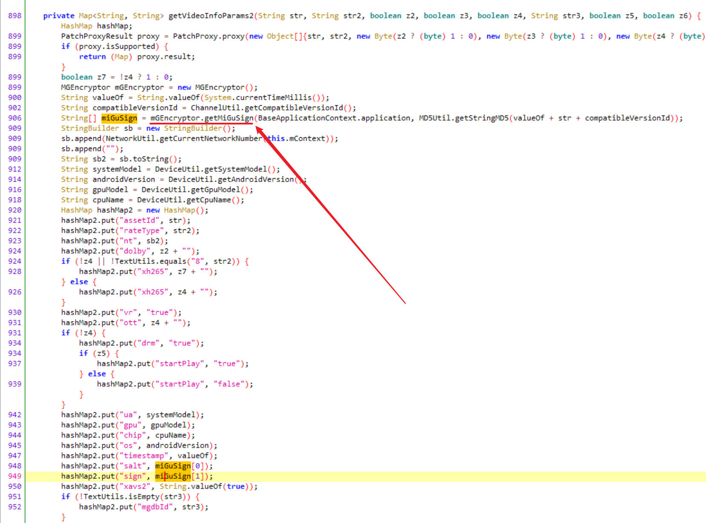

```bash
android hooking watch class_method com.cmcc.migutv.encryptor.MGEncryptor.getMiGuSign --dump-args --dump-backtrace --dump-return
```

```java
(agent) [104147] Called com.cmcc.migutv.encryptor.MGEncryptor.getMiGuSign(android.content.Context, java.lang.String)
(agent) [104147] Backtrace:
        com.cmcc.migutv.encryptor.MGEncryptor.getMiGuSign(Native Method)
        com.cmvideo.foundation.videocache.processor.VideoInfoProcessor.getVideoInfoParams(VideoInfoProcessor.java:205)
        com.cmvideo.foundation.videocache.processor.VideoInfoProcessor.getVideoInfo(VideoInfoProcessor.java:102)
        com.cmvideo.foundation.videocache.processor.VideoInfoProcessor.run(VideoInfoProcessor.java:65)
        com.cmvideo.foundation.videocache.chain.VideoInfoInvocationChain.getVideoInfo(VideoInfoInvocationChain.java:58)
        com.cmvideo.foundation.videocache.CacheController.getVideoInfo(CacheController.java:138)
        com.cmcc.cmvideo.player.PlayHelper.getVideoInfo(PlayHelper.java:984)
        com.cmcc.cmvideo.player.PlayHelper.preparePlayData(PlayHelper.java:776)
        com.cmcc.cmvideo.player.PlayHelper.preparePlayData(PlayHelper.java:725)
        com.cmcc.cmvideo.playdetail.widget.MgPlayPageFragment.getPlayUrl(MgPlayPageFragment.java:3481)
        com.cmcc.cmvideo.playdetail.widget.MgPlayPageFragment.onResume(MgPlayPageFragment.java:2290)
        android.support.v4.app.Fragment.performResume(Fragment.java:2498)
        android.support.v4.app.FragmentManagerImpl.moveToState(FragmentManager.java:1501)
        android.support.v4.app.FragmentManagerImpl.moveFragmentToExpectedState(FragmentManager.java:1784)
        android.support.v4.app.FragmentManagerImpl.moveToState(FragmentManager.java:1852)
        android.support.v4.app.FragmentManagerImpl.dispatchStateChange(FragmentManager.java:3269)
        android.support.v4.app.FragmentManagerImpl.dispatchResume(FragmentManager.java:3241)
        android.support.v4.app.FragmentController.dispatchResume(FragmentController.java:223)
        android.support.v4.app.FragmentActivity.onResumeFragments(FragmentActivity.java:538)
        android.support.v4.app.FragmentActivity.onPostResume(FragmentActivity.java:527)
        android.support.v7.app.AppCompatActivity.onPostResume(AppCompatActivity.java:172)
        android.app.Activity.performResume(Activity.java:8154)
        android.app.ActivityThread.performResumeActivity(ActivityThread.java:4428)
        android.app.ActivityThread.handleResumeActivity(ActivityThread.java:4470)
        android.app.servertransaction.ResumeActivityItem.execute(ResumeActivityItem.java:52)
        android.app.servertransaction.TransactionExecutor.executeLifecycleState(TransactionExecutor.java:176)
        android.app.servertransaction.TransactionExecutor.execute(TransactionExecutor.java:97)
        android.app.ActivityThread$H.handleMessage(ActivityThread.java:2066)
        android.os.Handler.dispatchMessage(Handler.java:106)
        android.os.Looper.loop(Looper.java:223)
        android.app.ActivityThread.main(ActivityThread.java:7664)
        java.lang.reflect.Method.invoke(Native Method)
        com.android.internal.os.RuntimeInit$MethodAndArgsCaller.run(RuntimeInit.java:592)
        com.android.internal.os.ZygoteInit.main(ZygoteInit.java:947)

(agent) [104147] Arguments com.cmcc.migutv.encryptor.MGEncryptor.getMiGuSign(com.cmcc.cmvideo.application.MGApplication@a9d9282, a42002edf5fdf989cb63a07327eb804c)
(agent) [104147] Return Value: 22441061,d9e1f6772cfb42705b6a9563ec7830c8
```

可以确定和链接中的sign一致（没错是链接中的，前面没有注意到


直接访问链接结果是请求校验失败，说明请求头还是不能缺少的


MGEncryptor的反编译代码

```java
package com.cmcc.migutv.encryptor;

import android.content.Context;
import android.text.TextUtils;
import com.meituan.robust.ChangeQuickRedirect;
import com.meituan.robust.PatchProxy;
import com.meituan.robust.PatchProxyResult;

public class MGEncryptor {
    public static ChangeQuickRedirect changeQuickRedirect;

    public native String[] getSignFromNative(Context context, String str);

    static {
        System.loadLibrary("mgencryptor");
    }

    public String[] getMiGuSign(Context context, String str) {
        PatchProxyResult proxy = PatchProxy.proxy(new Object[]{context, str}, this, changeQuickRedirect, false, 30812, new Class[]{Context.class, String.class}, String[].class);
        if (proxy.isSupported) {
            return (String[]) proxy.result;
        }
        if (context == null || TextUtils.isEmpty(str)) {
            return new String[]{"0000", "input error"};
        }
        try {
            return getSignFromNative(context, str);
        } catch (Exception e) {
            e.printStackTrace();
            return new String[]{"0000", "jni error"};
        }
    }
}
```

用IDA简单看一下，发现整体代码较少，下图依次是函数、字符、导入


不过今天并不打算还原算法，直接unidbg调用

拉一下最新版本的unidbg，然后做简单的so初始化载入

根据IDA直接看到的信息

可以看到有一个`/proc/self/maps`字符串，于是实现`IOResolver`

文件内容可以从内存中直接dump下来一份

同时很可能有jni交互，于是继承`AbstractJni`

同时导入里面有随机函数，于是用`HookZz`固定`lrand48`，只固定这一个是因为它用得最多

代码如下

```java
package com.cmcc.migutv.encryptor;

import com.github.unidbg.AndroidEmulator;
import com.github.unidbg.Emulator;
import com.github.unidbg.Module;
import com.github.unidbg.Symbol;
import com.github.unidbg.arm.context.EditableArm32RegisterContext;
import com.github.unidbg.file.FileResult;
import com.github.unidbg.file.IOResolver;
import com.github.unidbg.hook.HookContext;
import com.github.unidbg.hook.ReplaceCallback;
import com.github.unidbg.hook.hookzz.HookZz;
import com.github.unidbg.hook.hookzz.IHookZz;
import com.github.unidbg.linux.android.AndroidEmulatorBuilder;
import com.github.unidbg.linux.android.AndroidResolver;
import com.github.unidbg.linux.android.dvm.*;
import com.github.unidbg.linux.file.SimpleFileIO;
import com.github.unidbg.memory.Memory;
import java.io.File;
import java.util.ArrayList;
import java.util.List;

public class MGEncryptor extends AbstractJni implements IOResolver {
    private final AndroidEmulator emulator;
    private final VM vm;
    private final Module module;

    MGEncryptor() {
        emulator = AndroidEmulatorBuilder
                .for32Bit()
                .setProcessName("com.cmcc.cmvideo")
                .build();

        System.out.println("当前进程PID -> " + emulator.getPid());

        final Memory memory = emulator.getMemory(); // 模拟器的内存操作接口
        memory.setLibraryResolver(new AndroidResolver(23)); // 设置系统类库解析

        emulator.getSyscallHandler().addIOResolver(this); // 绑定IO重定向接口
        vm = emulator.createDalvikVM();
        vm.setVerbose(true); // 设置是否打印Jni调用细节

        DalvikModule dm = vm.loadLibrary(new File("unidbg-android/src/test/java/com/cmcc/migutv/encryptor/libmgencryptor.so"), true);
        module = dm.getModule();
        vm.setJni(this);

        IHookZz hookZz = HookZz.getInstance(emulator);
        Symbol lrand48 = module.findSymbolByName("lrand48");
        hookZz.replace(lrand48, new ReplaceCallback() {
            @Override
            public void postCall(Emulator<?> emulator, HookContext context) {
                EditableArm32RegisterContext ctx = emulator.getContext();
                System.out.println("lrand48 origin return ->" + ctx.getR0Int());
            }
        }, true);

        dm.callJNI_OnLoad(emulator);
    }

    @Override
    public FileResult resolve(Emulator emulator, String pathname, int oflags) {
        System.out.println("访问 -> " + pathname);
        if (("/proc/self/maps").equals(pathname)) {
            return FileResult.success(new SimpleFileIO(oflags, new File("unidbg-android/src/test/java/com/cmcc/migutv/encryptor/maps"), pathname));
        }
        return null;
    }

    public static void main(String[] args) {
        MGEncryptor mMGEncryptor = new MGEncryptor();
    }
}
```

然后运行得到下面的日志

```bash
当前进程PID -> 10097
访问 -> /dev/__properties__
访问 -> /proc/stat
访问 -> /proc/self/maps
JNIEnv->FindClass(com/cmcc/migutv/encryptor/MGEncryptor) was called from RX@0x400052ef[libmgencryptor.so]0x52ef
JNIEnv->RegisterNatives(com/cmcc/migutv/encryptor/MGEncryptor, RW@0x4000f004[libmgencryptor.so]0xf004, 1) was called from RX@0x40005305[libmgencryptor.so]0x5305
RegisterNative(com/cmcc/migutv/encryptor/MGEncryptor, getSignFromNative(Landroid/content/Context;Ljava/lang/String;)[Ljava/lang/String;, RX@0x4000a731[libmgencryptor.so]0xa731)
```

可以看到`getSignFromNative`动态注册于`0xa731`，现在补充`getSignFromNative`的调用

```java
public void getSignFromNative(){
    // args list
    List<Object> args = new ArrayList<>(4);
    // arg1 env
    args.add(vm.getJNIEnv());
    // arg2 jobject/jclazz 一般用不到，直接填0
    args.add(0);
    // arg3 context
    DvmObject context = vm.resolveClass("com/cmcc/cmvideo/application/MGApplication").newObject(null);
    args.add(vm.addLocalObject(context));
    // arg4 md5string
    StringObject md5string = new StringObject(vm, "a42002edf5fdf989cb63a07327eb804c");
    args.add(vm.addLocalObject(md5string));
    // call function
    Number number = module.callFunction(emulator, 0xa731, args.toArray())[0];
    System.out.println("number ->" + number);
    Object result = vm.getObject(number.intValue()).getValue();
    DvmObject[] strarr = (DvmObject[]) result;
    System.out.println("result ->" + strarr[0]);
    System.out.println("result ->" + strarr[1]);
};
```

报错，补充对应的jni调用

```bash
com/cmcc/cmvideo/application/MGApplication->getPackageManager()Landroid/content/pm/PackageManager;
```


```bash
com/cmcc/cmvideo/application/MGApplication->getPackageName()Ljava/lang/String;
```


成功返回结果，不过结果和hook的不一致

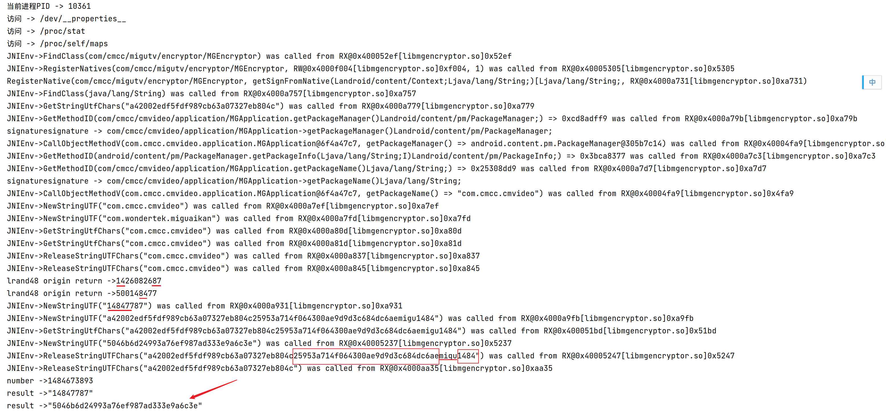

可以发现调用了`lrand48`，所以每次结果不一样

最终返回结果前有很长的一串字符串

简单测试发现最终结果就是这串字符串的md5


多次运行可以发现最终字符串构成如下

- 传入参数 a42002edf5fdf989cb63a07327eb804c
- 未知 25953a714f064300ae9d9d3c684dc6ae
- 固定值 migu
- 第二轮随机数的后六位的前四位 1484

最终返回结果的第一个字符串的构成

- 第一个随机数的末尾两位
- 第二个随机数的末尾六位


那么这个未知32位字符串是什么呢

根据日志可以知道最终进行md5的长字符串在`0xa9fb`产生

而很可惜这个地方原so没有内容

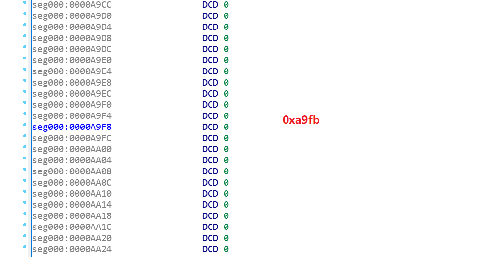

用[elf-dump-fix](https://github.com/maiyao1988/elf-dump-fix)从内存中dump并修复

现在这个位置有代码了，但是不能F5看伪代码

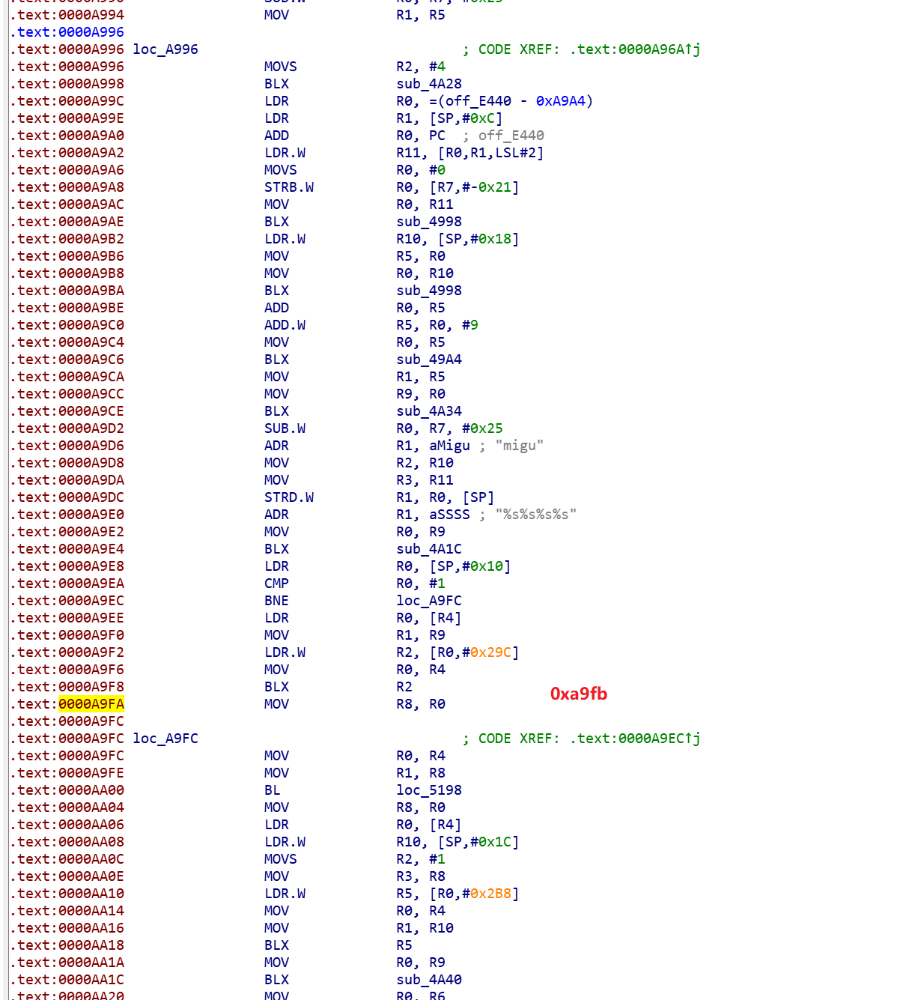

另外通过这里的`%s%s%s%s`可以推测应该是进行了字符串格式化，这里是4个字符串

这和前面通过重复执行推测的结论是一致的

如果尝试在函数开始的位置创建函数，则会出现这样的错误

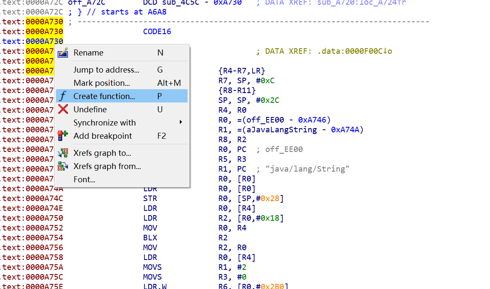

```bash
.text:0000AA5C: The function has undefined instruction/data at the specified address.
```

好在这种情况是有解的，参考

- [IDA sp-analysis failed 不能F5的 解决方案之(二)](https://bbs.pediy.com/thread-158896.htm)

将从函数起始位置到报错位置之前的部分选中，按P创建函数

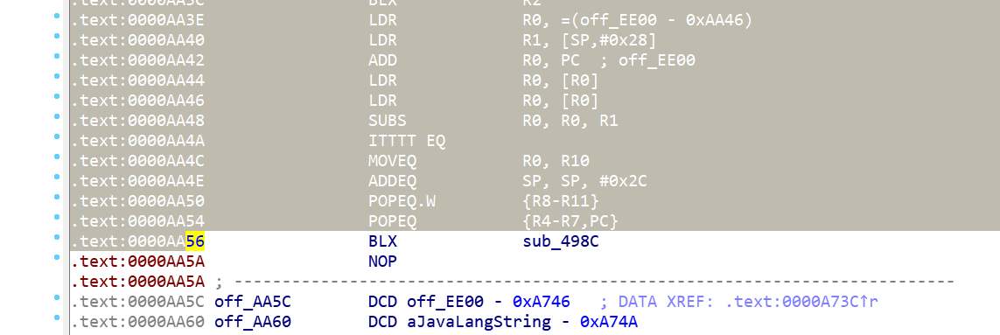

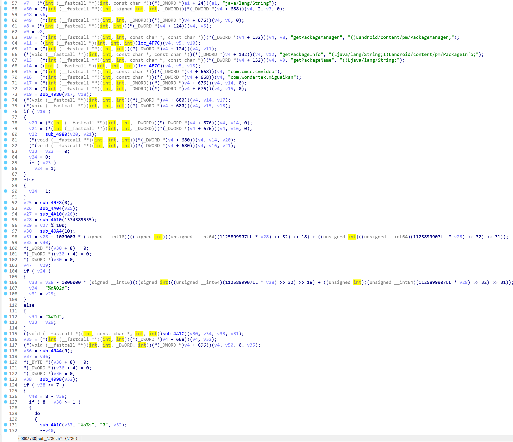

现在很容易看出来未知的字符串是怎么来的了


直接查看`off_E440`的数据，可以发现原来是一个固定的字符串数组

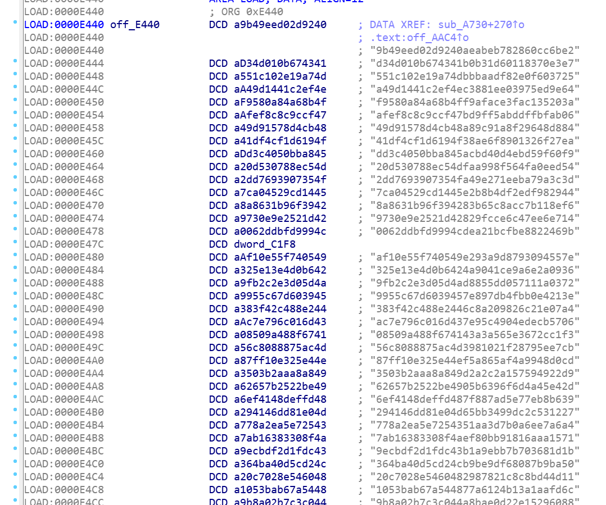

而索引值的计算是某个数对100取余数

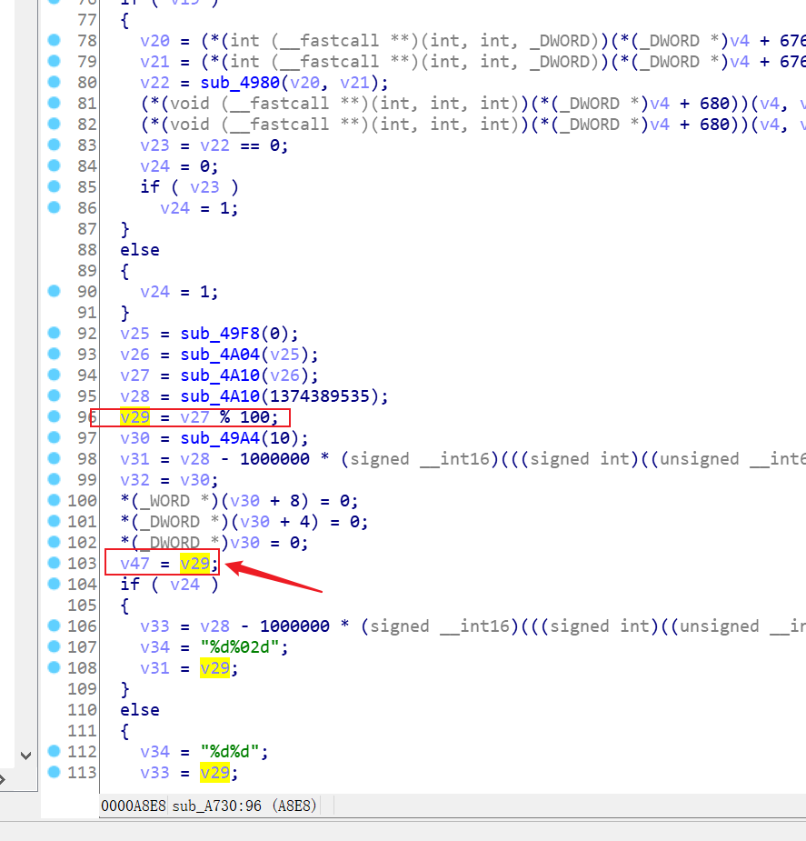

可以确定之前的计算中的字符串所在索引是74，正好是第一个随机数对100取余


综上分析，可以得出链接中的sign参数算法如下

~~只是计划用unidbg调用，没想到多看了两眼直接还原了~~

```python
import hashlib
from random import randint

SALT_TABLE = [
    '9b49eed02d9240aeabeb782860cc6be2',
    'd34d010b674341b0b31d60118370e3e7',
    '551c102e19a74dbbbaadf82e0f603725',
    'a49d1441c2ef4ec3881ee03975ed9e64',
    'f9580a84a68b4ff9aface3fac135203a',
    'afef8c8c9ccf47bd9ff5abddffbfab06',
    '49d91578d4cb48a89c91a8f29648d884',
    '41df4cf1d6194f38ae6f8901326f27ea',
    'dd3c4050bba845acbd40d4ebd59f60f9',
    '20d530788ec54dfaa998f564fa0eed54',
    '2dd7693907354fa49e271eeba79a3c3d',
    '7ca04529cd1445e2b8b4df2edf982944',
    '8a8631b96f394283b65c8acc7b118ef6',
    '9730e9e2521d42829fcce6c47ee6e714',
    '0062ddbfd9994cdea21bcfbe8822469b',
    'af10e55f740549e293a9d8793094557e',
    '325e13e4d0b6424a9041ce9a6e2a0936',
    '9fb2c2e3d05d4ad8855dd057111a0372',
    '9955c67d6039457e897db4fbb0e4213e',
    '383f42c488e2446c8a209826c21e07a4',
    'ac7e796c016d437e95c4904edecb5706',
    '08509a488f674143a3a565e3672cc1f3',
    '56c8088875ac4d3981021f28795ee7cb',
    '87ff10e325e44ef5a865af4a9948d0cd',
    '3503b2aaa8a849d2a2c2a157594922d9',
    '62657b2522be4905b6396f6d4a45e42d',
    '6ef4148deffd487f887ad5e77eb8b639',
    '294146dd81e04d65bb3499dc2c531227',
    '778a2ea5e7254351aa3d7b0a6ee7a6a4',
    '7ab16383308f4aef80bb91816aaa1571',
    '9ecbdf2d1fdc43b1a9ebb7b703681d1b',
    '364ba40d5cd24cb9be9df68087b9ba50',
    '20c7028e5460482987821c8c8bd44d11',
    '1053bab67a544877a6124b13a1aafd6c',
    '9b8a02b7c3c044a8bae0d22e15296088',
    'cc97fc32d3234500beea4f2a866a5788',
    'a19ef2dee5db46a18e510770002b4108',
    '992e27034ca84cfb82cdaa43e1c1e739',
    '7c228f634ce94bdbbb11c89758f60c00',
    '8c8c596dee1247d09b4d4317af1ef731',
    '1a8957f176bc4739b34d0d3331cda8f5',
    '2f6c2be2e48f49f78decf349e63265de',
    '72f1e5f5cb004912a7557d72e0f7f652',
    'fe15dabd9d984bd489c1478fd18ffe6c',
    '2b8972952cfc497d8826e8021a7d8d92',
    'bf987c51ea5c4ce78ec811d9288481d3',
    'd7b9fbea37954e329ee8608004d2da05',
    '87e9e9a543f9438490c1e59a63926f07',
    '6b558f2e86ad4696a3001ecf9fe4b21d',
    '9aeed1e21fbf4158b908aec943087eb0',
    'ac89a5dda0e143e894d435ac8995d24d',
    '2a15df822c0a4eb8a788e572afa4742c',
    '4c2c0ef25e234098bfb5f18c732a28a9',
    '1cbd413b3a61499bb810f2883303cb6a',
    '969298f797cc4265a3f2e87e4dfdc518',
    'ddac82a533ed48e98fa6b4de3a06feee',
    '3e2e6df232094bb9886b7595096e3e6b',
    '59ded02ca64c4c0ab3d5ede710371123',
    '40661ccbe2e644bc8172922b124a1710',
    'a3fa8d41ab654d56af396a54db24f7b5',
    'f92214baa3db40fabcfdb175a04ade66',
    'db8627874e774b539389f143ab1e0f8c',
    '0d6952220feb4a13a0f93e205b8d62cb',
    '5c3dd326f2da4057aa952256f45305ab',
    '750a698c5ad846f88f87aae00540505f',
    'cf73a3dd6d0c41fc9d9dbda95a4cf536',
    '008128a294ce42afa12f0ef90591aa7b',
    '729157e0c72a4f2087223661836d948f',
    'f8bbac1ddf5c4efb85cec18546a8088a',
    '173b8aa9dd664a33917e04adeff44684',
    '554ab71d3c0a41b1ab60ee7b1b758fae',
    '04a6af281972401d96674bff6fe767bb',
    'c3cb3544785f4a61a5fdf3ab78306561',
    '98a87ce236174e7ab69034aa38f659ba',
    '7f1654c5efa24dadba3703d82f97c45f',
    '5034a1b0f66a4094aabaa2a0d3bdc3b4',
    '9ff967e2f9ec40aab85a6501e8ce4d60',
    'bf0cc5b403c241c8b9323ddb2489a76e',
    '69e96fc4cf254c88a0cc92e7842ed4c8',
    '5f0920c74fef413c9a04aea044b93d7e',
    '4f6ebdd6a504445b9a38020f5a0e7aa7',
    'e00862ac9dc44ee8b3bb1e2c02162fb9',
    '9eec67c764014c139a392175e17a9998',
    '2ff76133ce0047a18219f072ab3adb09',
    '61cadeae84d449f197fad9736bf7921d',
    'f2238ccf20c84cd99336c165e8b40115',
    '25953a714f064300ae9d9d3c684dc6ae',
    '17bd953399894c17a7f96a7d9a14af9f',
    'f9098752968f478491a6d5d0dad456b9',
    '651bf4d967544a08994d1f17fd52bea8',
    '581ddc7f75be466ab3fbcc51d4ee0ffb',
    'bb9007a6f55a4a6daa5271418f0c16e5',
    '0696c78302d34b8cb9122e91c80fd935',
    'fe6afa3b778243548a36e7df3d8e7f68',
    'f5f121881568425d80b6cf2fe3f09e0d',
    '9100fcd3470f4c0f88b403f12eaaf65a',
    '3e1c91e67ff54838b28566f72478e3c6',
    '70689f17ac39440c91b4b0a82e77c58c',
    'd5deac6df499466680d6b6e74d86734c',
]


def url_sign(md5string: str):
    ''' 原算法两次随机数合并为一次 所以这里限定了下范围 '''
    salt = f'{randint(10000000, 99999999)}'
    text = f'{md5string}{SALT_TABLE[int(salt[6:]) % 100 - 1]}migu{salt[:4]}'
    sign = hashlib.new('md5', text.encode('utf-8')).hexdigest()
    return [salt, sign]


if __name__ == '__main__':
    print(url_sign('a42002edf5fdf989cb63a07327eb804c'))
```

传入参数也是一个md5，根据调用栈，上一级是`getVideoInfoParams`

```java
com.cmvideo.foundation.videocache.processor.VideoInfoProcessor.getVideoInfoParams(VideoInfoProcessor.java:205)
```

不过dump下来的dex没有找到这个类，有可能是前面去除不能打开的类的时候去掉了

好在在`com.cmvideo.capability.mgplayercore.net.VideoDetailsRequestHelper`里面有同样的方法

这个位置是传入字符串与时间戳与某个id相拼接


那么直接hook这个方法

```bash
android hooking watch class_method com.cmvideo.capability.mgkit.util.MD5Util.getStringMD5 --dump-args --dump-backtrace --dump-return
```

得到的传入参数是类似这样的

```java
com.cmvideo.capability.mgkit.util.MD5Util.getStringMD5(162962756341271472540225000903)
```

构成如下

- timestamp 1629627563412
- contId 714725402
- appVersion/X-UP-CLIENT-CHANNEL-ID截取前8位 25000903

请求头中的剩余校验参数后面再分析...